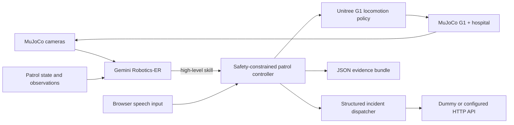

# Baymax Forward-Deployed Nurse

A two-room hospital simulation in which a Unitree G1 performs clinical rounds,
listens to a patient, observes bedside-monitor readings, detects a patient on
the floor, and sends structured incident reports to an HTTP endpoint.

The simulation uses MuJoCo for physics, Unitree's published G1 locomotion policy,
and Gemini Robotics-ER for high-level, vision-grounded skill selection. A
deterministic policy is included for repeatable validation without an API key.

> This is a robotics simulation and research prototype. It is not a medical
> device, does not make diagnoses, and must not be used for patient care.

## Demo sequence

1. The G1 walks into Room 101 without crossing the bed or walls.
2. Near the patient, it stops and listens until speech ends. With no speech, it
   continues after five seconds.
3. It combines the completed transcript with critical monitor readings and
   posts one incident report.
4. It routes through the central doorway into Room 202, approaches the patient
   lying on the floor, and posts a fall incident.
5. It returns to its starting point and saves an evidence bundle.

The live browser view shows the broadcast camera, robot ego camera, patrol
state, patient transcript, and dispatch feed.

## Architecture



Gemini selects only among bounded skills such as `navigate_room_1`,
`inspect_room_2`, and `dispatch_incident`. Deterministic waypoint routing,
collision geometry, velocity limits, command latency/dropout simulation, and a
watchdog remain outside the model.

## Requirements

- macOS for the visible MuJoCo viewer (`mjpython`)
- Python 3.11+
- Blender, only when importing the optional hospital art
- A Gemini API key, only for Gemini mode

The headless deterministic validation can run anywhere supported by MuJoCo.

## Setup

```bash
git clone https://github.com/KaushikSiva/baymax.git
cd baymax
scripts/setup_macos.sh
```

The setup creates `.venv` and downloads pinned upstream copies of the Unitree
G1 MJCF and locomotion policy. Their revisions and file hashes are enforced by
the scripts.

Optional realistic hospital art is prepared locally and is not committed. Put
these exact files in `~/Downloads/hospital_assets`:

```text
lowpoly-medical-room.zip
medical-examination-bed-game-ready-asset.zip
aero-monitor.zip
grandma-on-bench-free.zip
boy.glb
```

Then install Blender and run any launch command below. The launcher prepares
the assets automatically. Set `BAYMAX_ASSET_SOURCE` if they are elsewhere.
Without them, the simulation uses procedural patients and room furniture.

## Run

First verify the full route, both dispatches, collision clearance, and saved
evidence without calling Gemini:

```bash
scripts/run_baymax.sh validate --output-dir outputs/validation
```

Run the visible deterministic demo:

```bash
scripts/run_baymax.sh scripted --speech-mode browser
```

Run with Gemini Robotics-ER:

```bash
export GEMINI_API_KEY="your-key"
scripts/run_baymax.sh gemini --speech-mode browser --output-dir outputs/gemini
```

Open the URL printed by the process, normally
`http://127.0.0.1:8090/?wsPort=8770`. Use **MIC** or type a statement when the
robot reaches Room 101.

To dispatch to another service instead of the built-in dummy receiver:

```bash
export BAYMAX_DISPATCH_URL="http://127.0.0.1:9000/incidents"
scripts/run_baymax.sh gemini --speech-mode browser
```

## Evidence and API output

Every run writes inspectable files under `outputs/`, including:

- `dispatches.json` — HTTP requests, responses, monitor readings, and transcript
- `events.json` — timestamped patrol/listening/dispatch events
- `trajectory.json` — robot path, bed clearance, and wall-contact samples
- `result.json` and `run_report.json` — final outcome and safety metrics

The built-in dummy endpoint returns HTTP `202` and keeps the demo fully local.
Incident payloads include patient and room IDs, severity, a human-readable
summary, evidence sources, robot pose, monitor readings or patient speech when
available, and `simulationOnly: true`.

## Tests

```bash
.venv/bin/pytest -q
```

The integration test completes the two-room patrol and asserts exactly two
accepted dispatches, zero wall-contact samples, positive bed clearance, a
centered doorway crossing, and the Room 101 transcript/readings combination.

## Production integration roadmap

The current repository stops at a configurable incident HTTP call. The intended
production architecture adds LiveKit for realtime sessions, Deepgram for speech
recognition, a doctor voice-call workflow, MOSS-governed API actions, Medplum
record updates, and Stedi eligibility/claims workflows. Those integrations are
roadmap items, not implemented clinical capabilities in this simulation.

See [THIRD_PARTY_NOTICES.md](THIRD_PARTY_NOTICES.md) before distributing any
downloaded models or optional art.
