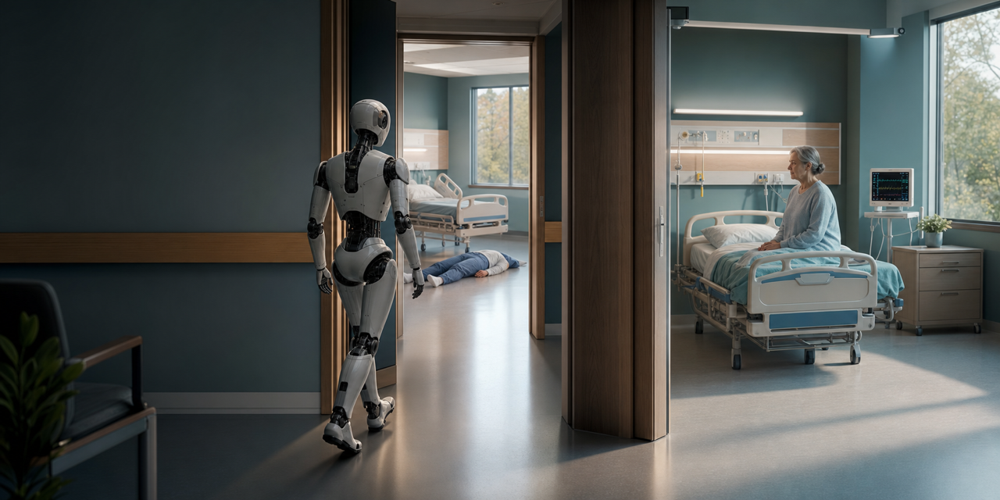
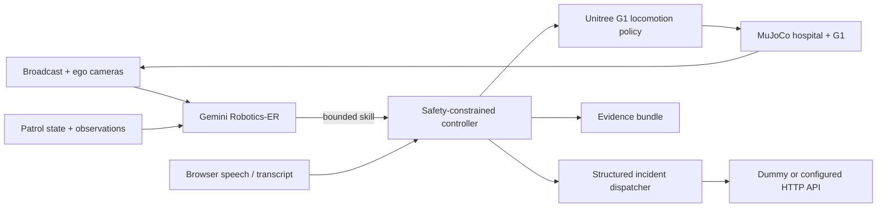

<p align="center">
  
</p>

<h1 align="center">Baymax</h1>

<p align="center">
  <strong>Forward-Deployed Nurse</strong><br />
  A Unitree G1 that walks the floor, listens, observes, and escalates.<br />
  An embodied-AI hospital simulation powered by MuJoCo, Gemini Robotics-ER,
  patient speech, and structured incident dispatch.
</p>

<p align="center">
  <a href="https://github.com/KaushikSiva/baymax/stargazers"></a>
  <a href="https://github.com/KaushikSiva/baymax/actions"></a>
  
  
</p>

<p align="center">
  <a href="#quickstart">Quickstart</a> ·
  <a href="#the-round">See the round</a> ·
  <a href="#architecture">Architecture</a> ·
  <a href="ROADMAP.md">Roadmap</a> ·
  <a href="CONTRIBUTING.md">Contribute</a>
</p>

> [!IMPORTANT]
> Baymax is a robotics simulation and research prototype—not a medical device.
> It does not diagnose, recommend treatment, or replace clinical judgment.

## Why this exists

Hospitals do not need another dashboard. They need systems that can move through
physical space, notice what changed, hear the person in the room, and bring the
right context to a human clinician.

Baymax is a compact, inspectable demonstration of that loop. One humanoid robot
completes a two-room round while a safety-constrained controller keeps navigation
and dispatch deterministic—even when Gemini chooses the next high-level skill.

## The round

| Step | Robot behavior | Observable result |
| --- | --- | --- |
| 01 · Room 101 | Routes around collision-enabled furniture and approaches the bedside | No bed or wall penetration |
| 02 · Listen | Stops while the patient speaks; leaves after speech ends or five seconds of silence | Final transcript is grounded to the encounter |
| 03 · Queue | Combines speech with the visible 148 BPM / 82% SpO₂ alarm | Critical-monitor incident held locally |
| 04 · Room 202 | Crosses the doorway and inspects Daniel Carter on the floor | Both queued incidents POST only after inspection |
| 05 · Return | Walks back to the start and writes evidence | Replayable events, trajectory, decisions, and API records |

What the deterministic integration test currently proves:

```text
2 rooms visited  ·  2 incidents accepted  ·  0 wall-contact samples
positive bed clearance  ·  centered doorway crossing  ·  transcript + vitals joined
```

## Quickstart

```bash
git clone https://github.com/KaushikSiva/baymax.git
cd baymax
scripts/setup_macos.sh
scripts/run_baymax.sh validate --output-dir outputs/validation
```

The validation policy needs no cloud key. It runs the complete round headlessly,
starts a local dummy dispatch receiver, and fails if the robot misses a room,
hits a wall, crosses a bed, or does not send exactly two alerts.

### Run the visual simulation

```bash
scripts/run_baymax.sh scripted --speech-mode browser
```

Open the URL printed by the process—normally
`http://127.0.0.1:8090/?wsPort=8770`. When the robot reaches Room 101, use
**MIC** or type a patient statement.

### Run with Gemini Robotics-ER

```bash
export GEMINI_API_KEY="your-key"
scripts/run_baymax.sh gemini --speech-mode browser --output-dir outputs/gemini
```

Gemini sees ego and broadcast camera frames plus grounded patrol state, then
selects one bounded skill such as `navigate_room_2` or `dispatch_incident`.
It never writes motor torques, edits routes, or bypasses dispatch deduplication.

## Architecture



| Layer | Responsibility |
| --- | --- |
| Gemini Robotics-ER | Vision-grounded high-level skill selection |
| Patrol controller | Route order, doorway waypoints, listening state, incident deduplication |
| Unitree policy | Learned G1 locomotion from bounded velocity commands |
| MuJoCo | Robot dynamics, contacts, collision geometry, cameras |
| Dispatch client | Retried JSON POST to a dummy or configured endpoint |
| Browser operations view | Live cameras, patrol status, speech capture, dispatch feed |

See [docs/ARCHITECTURE.md](docs/ARCHITECTURE.md) for control boundaries,
state transitions, and the incident contract.

## Bring your own hospital art

The repository does not redistribute third-party character or room meshes.
For the realistic local scene, put these exact files in
`~/Downloads/hospital_assets`:

```text
lowpoly-medical-room.zip
medical-examination-bed-game-ready-asset.zip
aero-monitor.zip
grandma-on-bench-free.zip
boy.glb
```

Install Blender, then launch normally. The launcher prepares the files into an
ignored local directory. Set `BAYMAX_ASSET_SOURCE` to use another folder.
Without these files, collision-safe procedural patients and furniture are used.

## Connect an API

Leave `BAYMAX_DISPATCH_URL` blank to use the built-in receiver, point it at your
own service, or explicitly select the deployed Baymax API:

```bash
scripts/run_baymax.sh gemini --speech-mode browser --baymax-api
```

> [!WARNING]
> The deployed endpoint can create patient/encounter/observation/task records
> and initiate a real doctor call. Use `--baymax-api` only when you intend those
> external actions. Headless validation always uses the local dummy receiver.

For a custom endpoint:

```bash
export BAYMAX_DISPATCH_URL="http://127.0.0.1:9000/incidents"
scripts/run_baymax.sh gemini --speech-mode browser
```

Example Room 101 payload:

```json
{
  "roomId": "room_1",
  "patientId": "patient_101",
  "patientName": "Eleanor Brooks",
  "incidentType": "critical_monitor",
  "severity": "critical",
  "monitorReadings": {
    "heartRateBpm": 148,
    "spo2Percent": 82,
    "alarm": "critical"
  },
  "patientSpeech": {
    "heard": true,
    "transcript": "I have severe chest pain and I'm having trouble breathing."
  },
  "simulationOnly": true
}
```

On acceptance, the deployed API returns the created patient, encounter,
observation, and task IDs, plus the doctor-call SID and clinician dashboard URL.

## Evidence, not vibes

Every run writes an inspectable bundle under `outputs/`:

- `dispatches.json` — exact HTTP requests and responses
- `events.json` — timestamped patrol, listening, detection, and dispatch events
- `trajectory.json` — robot path, bed clearance, and wall-contact samples
- `gemini_decisions.json` — model choices and rationale
- `sdk_command_trace.json` — constrained command-channel behavior
- `scene.xml`, `result.json`, and `run_report.json` — reproducible scene and outcome

## Development

```bash
.venv/bin/pytest -q
bash -n scripts/*.sh
python -m compileall -q baymax_nurse tests
```

The full local suite includes the two-room MuJoCo integration test. CI runs the
portable policy, dispatch, syntax, and packaging checks; physics validation is
kept local because it requires the pinned robot model and policy artifacts.

## Where this goes next

The current repository ends at a configurable incident HTTP call. The production
direction adds LiveKit realtime sessions, Deepgram speech recognition, an actual
doctor voice-call workflow, MOSS-governed tool calls, Medplum record updates,
and Stedi eligibility/claims workflows. These are roadmap items—not current
clinical capabilities.

Read the full [roadmap](ROADMAP.md), open an
[idea](https://github.com/KaushikSiva/baymax/issues/new?template=feature_request.yml),
or start with [CONTRIBUTING.md](CONTRIBUTING.md).

<p align="center">
  <strong>If embodied clinical AI should be observable, bounded, and testable, star the repo and help build it.</strong>
</p>

Third-party robot assets and policies retain their upstream licenses. Review
[THIRD_PARTY_NOTICES.md](THIRD_PARTY_NOTICES.md) before redistribution.
