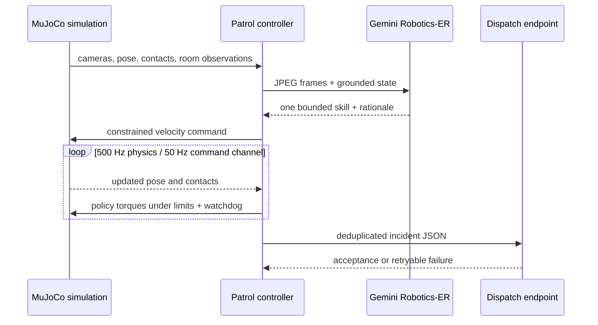
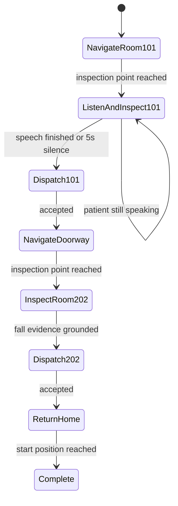

# Architecture

Baymax separates probabilistic perception and planning from deterministic
control. Gemini Robotics-ER may select a bounded high-level skill; it cannot
send joint commands, alter the collision model, skip the room order, or emit an
untracked clinical action.

## Control loop

## Patrol state machine

## Safety boundaries

- Collision-enabled beds, rails, boards, legs, walls, and fallen-patient proxy
- Doorway-centered route with explicit intermediate waypoints
- Velocity clipping, command slew limits, simulated packet loss and latency
- 120 ms locomotion command watchdog
- Fall detection and simulation-only recovery
- Fixed room order and exactly-once incident IDs
- `simulationOnly: true` on every dispatch payload
- No diagnosis or treatment recommendation in the model instruction

## Listening contract

Room 101 starts a listening window only after the robot reaches the inspection
point. A browser can send `patient_speech_started`, partial/final
`patient_transcript`, and `patient_speech_finished` messages. Once speech starts,
the robot remains stopped until the finish event. If speech never starts, it may
continue after five seconds. The final transcript and monitor readings become
one incident rather than two disconnected alerts.

## Incident contract

Every dispatch includes:

- stable incident, scenario, room, and patient identifiers, plus patient name
- timestamp, source, severity, robot pose, and evidence list
- a concise human-readable summary
- monitor readings and/or completed speech when relevant
- an explicit simulation-only marker

The configured endpoint receives an ordinary JSON `POST`. The bundled dummy
receiver returns HTTP 202, letting the same code path be validated without any
external service.

## Intended production boundary

LiveKit, Deepgram, doctor calling, Medplum, MOSS, and Stedi belong behind the
dispatch boundary. They are not silently mocked as completed integrations in
this repository. A production implementation must add authentication, consent,
audit logging, human confirmation, retry/idempotency policy, PHI controls, and
clinical validation before operating on real records or contacting clinicians.
